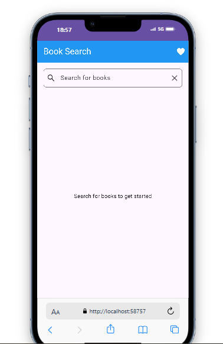
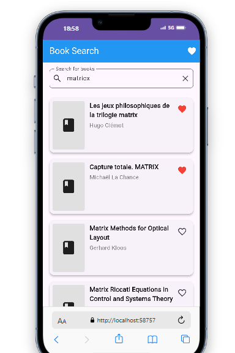
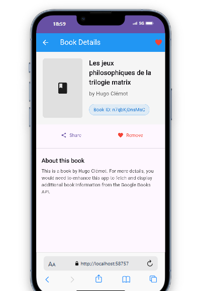
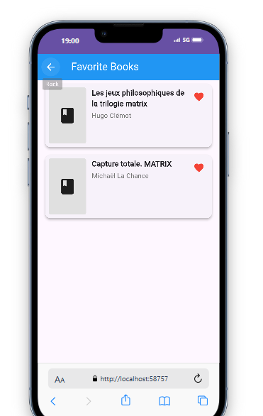

# Book Manager App



## Description
The Book Manager App is a Flutter application that allows users to search for books using the Google Books API, save their favorite books locally using SQLite, and manage their list of favorites. Users can search for books by keywords, view details such as title, author, and cover image, and easily add or remove books from their favorites.

## App Screenshots

| Home Screen | Search Results | Book Details | Favorites |
|-------------|----------------|--------------|-----------|
|  |  |  |  |

## Features
- Search for books using the Google Books API.
- Display search results with book details (title, author, image).
- Save favorite books locally in an SQLite database.
- View and manage a list of favorite books.
- Remove books from favorites with a simple action.
- Detailed book view with extended information.

## Project Structure
```
book_manager_app
├── lib
│   ├── main.dart               # Entry point of the application
│   ├── models
│   │   └── book.dart           # Book model definition
│   ├── services
│   │   ├── api_service.dart    # Service for API calls
│   │   ├── db_service.dart     # Database service for managing favorites
│   │   ├── storage_service.dart # Abstract storage interface
│   │   └── web_storage_service.dart # Web implementation for storage
│   ├── pages
│   │   ├── home_page.dart      # Home page for searching books
│   │   ├── detail_page.dart    # Detailed view of a book
│   │   └── favorites_page.dart # Page for displaying favorite books
│   └── widgets
│       └── book_item.dart      # Widget for displaying a single book
├── screenshots                 # App screenshots for documentation
├── pubspec.yaml                # Project configuration and dependencies
└── README.md                   # Project documentation
```

## Setup Instructions
1. Clone the repository:
   ```
   git clone <repository-url>
   cd book_manager_app
   ```

2. Install dependencies:
   ```
   flutter pub get
   ```

3. Run the application:
   ```
   flutter run
   ```

## Usage


- **Search for Books**: On the Home Page, enter a keyword in the search bar to find books.
- **Browse Results**: Explore search results with book covers, titles, and authors.
- **View Details**: Tap on any book to see more details and information.
- **Manage Favorites**: Add books to favorites by clicking the heart icon, or remove them with the same action.
- **View Favorites**: Navigate to the Favorites Page to see all your saved books in one place.

## Compatibility
The app works on multiple platforms:

- **Mobile**: Android and iOS
- **Web**: Chrome, Firefox, Safari
- **Desktop**: Windows, macOS, Linux

Each platform uses the appropriate storage mechanism (SQLite for native platforms, localStorage for web).

## API Reference
This application uses the Google Books API for searching books. Example API call:
```
https://www.googleapis.com/books/v1/volumes?q={keyword}
```

## License
This project is open-source and available under the MIT License.

## About the Developer
This application was developed by Youssef Ouben Said as a Flutter project demonstrating the implementation of API integration and local storage. With a passion for mobile development and clean architecture, I designed this app to showcase best practices in Flutter development.

